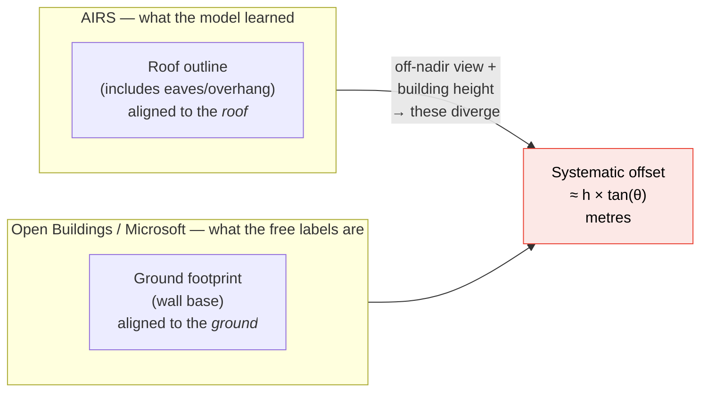

# 01 — Situation and Assets

*What we actually have, measured rather than assumed.*

---

## 1. Trained models (source domain)

### Stage 1 — Rooftop, trained on AIRS

| Property | Value |
|----------|-------|
| Architecture | U-Net, ResNet-34 encoder (ImageNet-pretrained), `segmentation-models-pytorch` |
| Loss | `0.5 × SoftBCEWithLogits + 0.5 × Dice` |
| Training data | AIRS — Christchurch, New Zealand |
| Source GSD | **7.5 cm/px** |
| Label semantics | **Roof outlines**, not ground footprints (AIRS-specific — see §5) |
| Crop size | 512 × 512, 10 % overlap |
| Best result | IoU **0.9016** on a 210-image test subset; **0.8664** on the full test set |
| Paper baseline beaten | PSPNet, IoU 0.899 (Chen et al., 2019, ISPRS) |
| Best inference threshold | 0.35 (model is under-confident) |
| Code | `rooftop/train.py`, `evaluate.py`, `infer.py`, `tile_airs.py` |

`train.py` already exposes a `--simulate_low_res` flag that downscales to
simulate 30 cm imagery. **This flag is now the most important one in the
repository** — see [`02-domain-gap-analysis.md`](02-domain-gap-analysis.md).

### Stage 2 — Solar panel, trained on BDAPPV

| Property | Value |
|----------|-------|
| Architecture | Same (U-Net / ResNet-34) |
| Training data | BDAPPV — France, Google + IGN imagery |
| Tile size | ~400 × 400 px |
| Notable handling | Black-mask fallback for negative (no-panel) images |
| Code | `solar_panel/train_solar.py`, `evaluate_solar.py`, `infer_solar.py`, `prep_bdappv.py` |

---

## 2. Target-domain imagery (Jaipur) — measured

### The full dataset is 16 tiles, ~8.2 GB

Source: [Google Drive `final_dataset`](https://drive.google.com/drive/folders/1CruuRQUNddyQYGrTWfZw3rsxl4iz3hVF).
~~Only 2 of the 16 are downloaded locally so far~~ — **all 16 restored to the DGX at
`data/jaipur/` on 2026-09-08** (8.0 GB).

### The master Drive folder, enumerated 2026-09-09

`final_dataset` is one subfolder of the project's master Drive folder:

**`https://drive.google.com/drive/folders/1KUxrm799xf9KqEJCwTYbaHvrJlCa1_Rk`** — 574 files.

| Path | Files | What it is |
|---|---|---|
| `DAtaset/dataset/{image,label}` | 50 + 50 | AIRS, top-level split |
| `DAtaset/dataset/train/{image,label}` | 50 + 50 | AIRS train subset |
| `DAtaset/dataset/val/{image,label}` | 50 + 50 | AIRS val subset |
| `DAtaset/dataset/{train,val}.txt` | 2 | the official 857 / 94 split lists |
| `DAtaset/final_dataset` | 16 | Jaipur mosaic ✅ restored |
| `DAtaset/american house/{img,mask}` | 50 + 50 | US rooftop set + masks |
| `DAtaset/american house/rooftop_results/` | 101 | inferred masks, overlays, `rooftop_areas.csv` |
| `DAtaset/Solar_Panel.coco.zip` | 1 | COCO-format solar panel set |
| `results , unet/` | 53 | roof/solar overlays, 9 manual Indian test screenshots |

> ### ⚠ The full AIRS dataset is NOT in Drive, and never was
>
> **`train.txt` lists 857 images. Drive holds 75 unique labelled pairs, of which 25 appear
> in `train.txt`.** The three AIRS folders hold 50 images each, and each `label/` folder is
> **half `_vis` preview files** — so 50 label files means only **25 real masks**, and the
> three folders do not overlap.
>
> This is not a truncated listing. gdown caps folder enumeration at 50 files
> (`MAX_NUMBER_FILES`); the counts above were re-enumerated with that cap raised to 100,000
> and did not change. The 50s are real.
>
> **Consequence:** the AIRS restore *cannot be completed from Drive.* Re-running
> `scripts/fetch_drive_folder.py` will converge on 75 pairs and stop, no matter how many
> times it is run. To get the real thing, download AIRS from its official source
> (<https://www.airs-dataset.com/>, ~28 GB) — and record the link here when you do.
>
> **The baseline is currently not reproducible.** `logs/unet_resnet34_2000samples_100ep_20260330_125206.json`
> shows the seed checkpoint was trained with `max_samples = 2000` crops read from
> `/tmp/train_crops` and `/tmp/val_crops` — paths on a machine that no longer holds them.
> Best val IoU **0.8784** @ epoch 90, against the PSPNet baseline of 0.899. That number
> cannot presently be re-derived from anything on disk or in Drive.

| | |
|---|---|
| Files | `map67_<col>-<row>.tif`, col ∈ 1–4, row ∈ 1–4 |
| Size each | 482–527 MB (~512 MB average) |
| **Total** | **~8.2 GB** |

**Grid orientation, derived from the two local tiles' tiepoints:** `1-1` and
`1-2` share the same Mercator *x* (8429249.6) and differ in *y* by exactly
4137.2 m = 13856 px × 0.29858. So the **first index is the column (eastward)
and the second is the row (southward)**, and tiles abut exactly with no
overlap.

| Quantity | Full 4 × 4 mosaic |
|----------|-------------------|
| Pixel dimensions | **44,672 × 55,424 px** (2.48 gigapixels) |
| Longitude span | 75.7212 °E → 75.8411 °E |
| Latitude span | 26.8265 °N → 26.9576 °N |
| Ground extent | **11.9 km × 14.8 km ≈ 175 km²** |
| GSD variation across the mosaic | 0.26613 → 0.26637 m/px (0.1 % — ignorable) |
| **512 × 512 tiles at 10 % overlap** | 24 cols × 29 rows × 16 = **≈ 11,140** |
| Estimated buildings (Open Buildings) | **~300,000 – 500,000** |

That is essentially the whole of Jaipur city, and it changes the project's
character: ~11k tiles and hundreds of thousands of free weak labels is no
longer a small-data problem. See §7 for what it breaks.

### Also present locally, not in the Drive folder

`daraset/projs.tif` — 3924 × 2092 px, origin 75.91837 °E / 26.93791 °N. This
sits **east of the main grid** (outside the 4 × 4 box), covering ~1.04 × 0.56 km.
Provenance unknown; treat as a separate demo/scratch area, not part of the
mosaic, until confirmed.

### Per-tile measurements

Both local GeoTIFFs, ~537 MB and ~541 MB on disk.

```
$ python  # reading the TIFF tags directly
daraset/map67_1-1.tif   11168 × 13856   RGB, 8-bit, LZW
  ModelPixelScale (33550) : 0.2985821417  (Web Mercator metres/px)
  ModelTiepoint   (33922) : x=8429249.60  y=3118173.77  (EPSG:3857)
  → origin lon/lat        : 75.72124 E, 26.95759 N     ← Jaipur ✓
  GeoKeyDirectory present : yes
```

### Deriving the true ground resolution

Web Mercator metres are not ground metres. The projection stretches distance by
`1/cos(latitude)`. Also note that `156543.03392 / 2^19 = 0.298582…`, which
matches the pixel scale exactly — confirming these are **zoom level 19** tiles.

```
true GSD = 0.2985821 × cos(26.9576°)
         = 0.2985821 × 0.891497
         = 0.26613 m/px
```

| Quantity | Value |
|----------|-------|
| Web Mercator pixel scale | 0.2986 m/px (z19) |
| **True ground GSD** | **0.2661 m/px ≈ 26.6 cm/px** |
| Ground area per pixel | **0.0708 m² = 708 cm²/px** |
| Ground extent, one tile | 2.97 km × 3.69 km ≈ **11.0 km²** |
| 512 × 512 tiles per file (10 % overlap) | 24 × 29 = **696** |

> **Correction to the project brief.** The imagery was described as
> "~10 cm per pixel". It is 26.6 cm/px. To actually get ~10 cm ground
> resolution at Jaipur's latitude you would need a Mercator pixel scale of
> ~0.112 m — i.e. between zoom 20 and 21. Google's satellite basemap for
> Jaipur generally tops out around z19–z20, so 26.6 cm is likely the best
> available from this source. **Plan for 26.6 cm.**

### Also present, unmeasured

| Path | Contents | Status |
|------|----------|--------|
| `test_indian/` | 9 PNG screenshots | Unlabelled, unregistered, unknown zoom — useful only for eyeballing |
| `daraset/mx/` | 2 small JPEGs + empty `C3-MX/` | No apparent value; ignore |
| `rooftop/christchurch_370.tif` | One AIRS source tile | Useful as a side-by-side visual reference |
| `airs.pdf` (24 MB) | The AIRS paper | Reference only — **must be gitignored** |

---

## 3. What we do **not** have

This list is the real project risk register.

1. **Any Jaipur ground-truth labels.** Zero. Not one polygon.
2. **A target-domain evaluation set.** Without this, every claim about domain
   adaptation is unfalsifiable. This blocks everything.
3. **Georeferenced validation of the tiles beyond the header** — the GeoTIFF
   tags have not been cross-checked against a known landmark. Worth 10 minutes.
4. **Legally clean training imagery.** See
   [`07-risks-licensing-ethics.md`](07-risks-licensing-ethics.md).
5. **Any Indian solar-panel labels at all**, for Stage 2.

---

## 4. Free target-domain label sources (this is the good news)

Both of these cover Jaipur, are openly licensed, and can be rasterised straight
onto all 16 GeoTIFFs because you have the geotransform.

| Source | Coverage | Licence | Notes |
|--------|----------|---------|-------|
| [Microsoft GlobalMLBuildingFootprints](https://github.com/microsoft/GlobalMLBuildingFootprints) | **110 M India footprints** (2024 update) | ODbL v1.0 | Line-delimited GeoJSON, partitioned by quadkey |
| [Google Open Buildings v3](https://sites.research.google/gr/open-buildings/) | South Asia incl. India, 1.8 B detections | CC BY 4.0 **or** ODbL v1.0 (your choice) | Includes a per-building confidence score — use it to filter |
| [VIDA Google–Microsoft–OSM combined](https://source.coop/vida/google-microsoft-osm-open-buildings) | Global, deduplicated merge of all three | ODbL | Usually the most convenient single download |
| OpenStreetMap (Jaipur) | Walled city well-mapped; outskirts sparse | ODbL | Best-quality where present; use as spot-check |

**Rough expectation:** at Jaipur's density, the full 175 km² should contain on the order
of **40,000–70,000** building polygons. That is a large weakly-supervised
training set for free.

**Important caveat:** these are *footprints derived from ~30–50 cm satellite
imagery*, so they are (a) coarser than your 26.6 cm pixels, (b) often
horizontally offset by 2–8 m, and (c) footprints rather than roof outlines.
They are **noisy labels, not ground truth.** The pipeline in
[`04-pipeline.md`](04-pipeline.md) treats them accordingly.

---

## 5. The label-semantics trap

This is subtle and will silently cost you IoU if ignored.



For a 4-storey Jaipur building (~12 m) viewed 10° off-nadir, roof and footprint
differ by ~2 m — about **8 pixels** at 26.6 cm. Combined with the 2–8 m
georeferencing offset in the open datasets, raw rasterised footprints can be
displaced by 10–35 pixels. Correcting this is a required pipeline step, not an
optional refinement.

**Decision to make explicitly and record:** does this project predict *roof
outlines* (consistent with AIRS, and correct for solar-area estimation) or
*ground footprints*? **Recommendation: roof outlines** — you are estimating
rooftop solar potential, so the roof is the thing that matters.

---

## 6. Repository hygiene — fix before the next commit

`daraset/` (1.08 GB), `airs.pdf` (24 MB), and `rooftop/christchurch_370.tif`
are all currently untracked but **not gitignored**. One careless `git add -A`
will push a gigabyte to the remote. This plan's Task 0 fixes that.

---

## 7. What the full 16-tile dataset breaks

### 7.1 Disk space — this is a hard blocker

Measured 2026-08-04:

| Drive | Free |
|-------|------|
| C: | **1.6 GB** |
| D: | **7.8 GB** |
| G: (external SSD) | **43.8 GB** |

The remaining 14 tiles are ~7.1 GB. Downloading them to `D:\projs\btp\daraset\`
would leave under 1 GB free on D:, and that is **before** the derived data:

| Artefact | Estimated size |
|----------|---------------|
| 16 source GeoTIFFs | 8.2 GB |
| ~11,140 tile PNGs (512², RGB) | 4–7 GB |
| Weak label masks (PNG, 1-bit-ish) | 0.2–0.5 GB |
| Probability maps / pseudo-labels (float16) | 5–11 GB if cached |
| **Total** | **≈ 18–27 GB** |

**Do not download the full dataset to C: or D:.** Options, best first:

1. **G:** (43.8 GB free) — set `daraset/` and `jaipur_crops/` to live there.
2. **DGX `/scratch`** — download directly on the DGX with `gdown`/`rclone`; it
   never needs to touch this laptop. Remember `/scratch` is not persistent.
3. **Work on a subset** — 4 of the 16 tiles (~44 km²) is still 2× the area the
   original plan assumed and fits comfortably on D:. A reasonable fallback if
   G: is unavailable.

### 7.2 The SAM2 labelling budget no longer fits

The Colab budget in [`05-compute-and-schedule.md`](05-compute-and-schedule.md)
allocated 140 compute units for SAM2 refinement over ~1,180 tiles. At ~11,140
tiles that becomes roughly **1,300 units — more than double the entire 600-unit
balance.**

Resolution: **do not SAM-refine everything.** Refine only what training
actually consumes:

| Set | Tiles | SAM2 refined? |
|-----|------:|---------------|
| Clean hand-labelled (train/val/test) | 400 | yes |
| Weak training subset | 2,500 | yes |
| Remaining weak tiles | ~8,200 | no — raw shifted polygons only |
| Inference-only (final city-wide map) | all 11,140 | n/a |

2,500 + 400 tiles ≈ 290 units — over budget but survivable against the 200-unit
reserve, and reducible by sampling 1,500 instead. Sample the weak subset
**stratified by building density and by mosaic tile**, so all 16 tiles and all
urban fabric types are represented.

### 7.3 Things the extra data makes *better*

- **Spatial block splits become genuinely clean.** With 16 tiles you can hold
  out 2–3 entire tiles as the test region — geographically disjoint, not merely
  block-disjoint. This is a much stronger evaluation claim.
- **Fabric diversity.** 175 km² spans the dense walled city, planned colonies,
  industrial areas, and peri-urban fringe. The per-density-bin evaluation in
  [`04-pipeline.md`](04-pipeline.md) §4 becomes far more meaningful.
- **Weak supervision scales.** 300k–500k free footprints is a serious training
  set — enough that Phase D could plausibly carry the project on its own.
- **A city-wide solar-potential map** becomes a deliverable in its own right,
  which is a much stronger BTP demo than a single-patch result.

### 7.4 Revised hand-labelling target

Bump from 300 to **400 tiles**, stratified across all 16 mosaic tiles (25 per
tile). The extra 100 tiles cost ~3 hours and buy evaluation coverage of urban
fabric types that 300 tiles drawn from 2 mosaic tiles could not represent at all.
