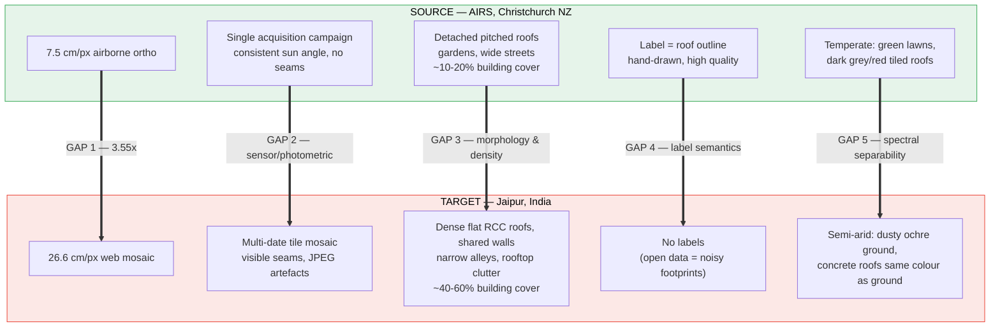

# 02 — Domain Gap Analysis

*Why an IoU-0.90 model on Christchurch will do badly on Jaipur, decomposed into
six independent gaps, ordered by how much damage each does.*

---

## The gap at a glance

---

## Gap 1 — Resolution (**dominant**)

| | Source | Target | Ratio |
|---|---|---|---|
| GSD | 7.5 cm/px | 26.6 cm/px | **3.55×** |
| Area per pixel | 56.25 cm² | 708 cm² | **12.6×** |
| A 3 m-wide feature spans | 40 px | 11 px | — |
| A 0.5 m parapet spans | 6.7 px | 1.9 px | — |

A CNN's learned features are scale-specific. A ResNet-34 U-Net trained where a
roof ridge is 40 px wide has filters tuned to 40-px ridges; at 11 px, those
filters see something structurally different. This is not a subtle effect — it
is typically the difference between IoU 0.90 and IoU 0.45.

**Why this is also the easiest gap to close.** Resolution shift is fully
simulable from source data. You can downsample AIRS to exactly 26.6 cm and
train there, and you can augment across a scale *range* so the model becomes
scale-robust. Your `train.py --simulate_low_res` flag already does a crude
version of this. Two refinements needed:

1. Simulate the *right* GSD (26.6 cm, not 30 cm), and simulate a **range**
   (0.15–0.40 m) rather than a single value, so the model generalises.
2. Simulate the *degradation chain*, not just the resize: real 26.6 cm web
   imagery has been resampled, sharpened, and JPEG-compressed. Downsample with
   an anti-alias-correct filter, then apply mild JPEG compression (quality
   65–90) and a slight unsharp mask. Naive `cv2.resize` alone produces
   unrealistically clean low-res images and the model will not transfer.

---

## Gap 2 — Sensor and photometric shift

| Axis | AIRS | Jaipur mosaic |
|------|------|---------------|
| Platform | Airborne, near-nadir | Satellite/aerial mix, variable off-nadir |
| Acquisition | Single campaign | Mosaic of many dates — **visible seams inside a single tile** |
| Compression | Lossless TIFF | JPEG-derived, blocking artefacts at 8×8 |
| Sun elevation | Mid-latitude, moderate | Low-latitude, high sun → short hard shadows |
| Atmosphere | Clear maritime | Dust haze, low contrast, warm cast |
| Colour grading | Raw ortho | Google's automatic tone-mapping / saturation boost |

Mosaic seams are worth calling out separately: a single 512 × 512 crop can
contain two acquisitions with different colour balance and different shadow
directions. No amount of global colour normalisation fixes that — the model
must be made robust to it via augmentation, not corrected for it.

**Closable by:** photometric augmentation (HSV jitter, CLAHE, gamma, JPEG),
histogram matching, Fourier Domain Adaptation. Cheap, and mostly training-free.

---

## Gap 3 — Object morphology and scene density

This is the gap you cannot simulate from AIRS, and therefore the one that
requires actual Jaipur data.

| Property | Christchurch | Jaipur |
|----------|-------------|--------|
| Roof form | Pitched, tiled, distinct ridge lines | **Flat RCC slabs** — no ridge, no shading cue |
| Separation | Detached, garden gaps of 3–10 m | **Shared party walls** — zero gap between units |
| Density | ~10–20 % building cover | ~40–60 %, up to 80 % in the walled city |
| Roof clutter | Rare | **Ubiquitous**: water tanks (Sintex), parapets, stairwell head-rooms, laundry, satellite dishes, solar water heaters |
| Street width | Wide, tree-lined | Narrow alleys, 2–3 m — only ~8–11 px wide at 26.6 cm |
| Building height variance | Low (1–2 storey) | High (1–8 storey), heavy inter-building shadow occlusion |

Consequences:

- **Instance merging.** With shared walls and no visible gap, a semantic model
  fuses whole blocks into one blob. If the BTP only needs *total rooftop area*
  this is tolerable; if it needs per-building capacity it is fatal, and you
  need boundary-aware supervision (see [`03`](03-methods-and-literature.md) on
  frame-field learning / boundary loss).
- **Under-segmentation of alleys.** An 8-px alley between two roofs is at the
  limit of what a decoder at stride 4 can resolve.
- **Clutter false negatives.** A dark water tank on a bright roof reads as
  "not roof" to a model that never saw one.
- **Class prior shift.** AIRS is ~15 % positive pixels; Jaipur is ~50 %. A
  model calibrated on a 15 % prior will systematically under-predict. This
  alone justifies re-tuning the decision threshold on target data (you already
  found 0.35 beats 0.5 — expect the optimum to move *further* on Jaipur).

---

## Gap 4 — Label semantics

Covered in [`01-situation-and-assets.md`](01-situation-and-assets.md) §5.
Summary: AIRS labels roof outlines; the free Indian labels are ground
footprints from a different sensor with 2–8 m georeferencing error. Naively
rasterising them produces labels displaced by **10–35 px**, which will actively
teach the model to be wrong.

Mitigations, in order of effectiveness:
1. **SAM2-based snapping** — use each polygon's centroid as a point prompt on
   the *Jaipur* image, take SAM's mask, and keep it if IoU with the polygon
   exceeds a threshold. This re-anchors labels to the actual visible roof.
2. **Global + local shift estimation** — phase correlation between the
   rasterised footprint mask and the current model's probability map, solved
   per 1024 × 1024 block. Cheap, catches the systematic offset.
3. **Boundary-relaxed loss** — ignore a 3–5 px band around every label edge so
   residual misalignment does not dominate the gradient.
4. **Confidence filtering** — Google Open Buildings ships a confidence score;
   drop anything below ~0.75.

---

## Gap 5 — Spectral separability

In Christchurch, roofs are chromatically distinct from their surroundings
(dark tiles against green lawn). In Jaipur, a bare concrete roof, an unpaved
lane, and a construction plot are all the same desaturated grey-beige. The
*colour* cue that carries much of the AIRS model's decision is largely absent.

The model must therefore lean on **texture and geometry** — parapet shadow
lines, rectilinearity, regular clutter patterns. That argues for:
- a backbone with larger effective receptive field / global context
  (SegFormer, or HRDA's multi-resolution context) over plain ResNet-34;
- strong colour augmentation during source training, to *force* the model off
  the colour shortcut and onto shape.

---

## Gap 6 — Stage 2 (solar) has its own, worse gap

BDAPPV is France. The transfer to India adds:

| | France (BDAPPV) | India |
|---|---|---|
| Mounting | Flush on pitched tiled roofs | **Tilted frames on flat roofs** — cast their own shadow, viewed at an angle |
| Array shape | Large contiguous rectangles | Small scattered arrays, irregular |
| Confusers | Few | **Solar water heaters** (evacuated-tube / flat-plate) are visually near-identical from above and are far more common than PV in Indian residential settings |
| Base rate | Moderate | Very low — most Jaipur roofs have no PV at all |

The solar-water-heater confusion is a genuine, publishable failure mode and you
should measure it explicitly rather than let it hide inside an aggregate IoU.
With a very low base rate, **precision matters far more than recall**, and IoU
is a poor headline metric — report precision/recall separately and a per-roof
detection rate.

---

## What this implies for method selection

| Gap | Simulable from source? | Needs target images? | Needs target labels? |
|-----|:---:|:---:|:---:|
| 1 Resolution | ✅ fully | ⬜ | ⬜ |
| 2 Photometric | 🟡 partly | ✅ (for FDA/hist-match) | ⬜ |
| 3 Morphology | ❌ | ✅ | ✅ |
| 4 Label semantics | ❌ | ✅ | ✅ |
| 5 Spectral | 🟡 partly | ✅ | ⬜ |
| 6 Solar | ❌ | ✅ | ✅ |

Read the last two columns: **gaps 1, 2 and 5 are free** — closable with
augmentation and unlabelled target images. **Gaps 3, 4 and 6 require target
labels**, which is why building the labelled Jaipur set is the critical path
and why weak supervision from open building data (Phase D) is the highest-
leverage single action in the whole plan.
