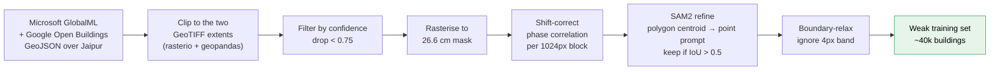

# 03 — Methods and Literature

*What the field does about cross-domain building segmentation, what is worth
your time, and what is not. All sources listed in
[`08-sources.md`](08-sources.md).*

---

## The method landscape

```mermaid
flowchart TD
    ROOT["Domain shift:<br/>AIRS → Jaipur"]

    ROOT --> T1["<b>Tier 1</b><br/>Input-space alignment<br/><i>no training</i>"]
    ROOT --> T2["<b>Tier 2</b><br/>Domain generalisation<br/><i>source training only</i>"]
    ROOT --> T3["<b>Tier 3</b><br/>Unsupervised DA<br/><i>+ unlabelled target</i>"]
    ROOT --> T4["<b>Tier 4</b><br/>Weak / semi supervision<br/><i>+ noisy target labels</i>"]
    ROOT --> T5["<b>Tier 5</b><br/>Foundation models"]

    T1 --> T1a["GSD resampling"]
    T1 --> T1b["Histogram matching"]
    T1 --> T1c["FDA — Fourier amplitude swap"]
    T1 --> T1d["AdaBN — recompute BN stats"]
    T1 --> T1e["Multi-scale + flip TTA"]
    T1 --> T1f["Threshold recalibration"]

    T2 --> T2a["Scale + photometric aug"]
    T2 --> T2b["Multi-source training<br/>AIRS + Inria + WHU"]
    T2 --> T2c["Transformer backbone<br/>SegFormer / MiT"]

    T3 --> T3a["Confidence self-training"]
    T3 --> T3b["DACS / DAFormer"]
    T3 --> T3c["HRDA — multi-res"]
    T3 --> T3d["MIC — masked consistency"]

    T4 --> T4a["Open Buildings rasterised"]
    T4 --> T4b["SAM2 label refinement"]
    T4 --> T4c["Boundary-relaxed loss"]
    T4 --> T4d["Hand-labelled eval set"]

    T5 --> T5a["CrossEarth (RSDG)"]
    T5 --> T5b["SAM2 as label engine"]

    style T1 fill:#e6f4ea,stroke:#34a853,color:#000
    style T2 fill:#fef7e0,stroke:#fbbc04,color:#000
    style T3 fill:#f3e8fd,stroke:#a142f4,color:#000
    style T4 fill:#fce8e6,stroke:#ea4335,color:#000
    style T5 fill:#e8f0fe,stroke:#4285f4,color:#000
```



---

## Tier 1 — Input-space alignment (do this first, it is nearly free)

### 1.1 GSD resampling — the highest value-per-effort action in the plan

Two directions, and they are not equivalent:

- **Upsample target to source GSD** (Jaipur 26.6 cm → 7.5 cm, ×3.55). Fast to
  test, requires no retraining. But you are inventing detail that does not
  exist; the model sees blurry versions of features it knows. Usually gives a
  modest gain.
- **Downsample source to target GSD** (AIRS 7.5 cm → 26.6 cm) and retrain.
  Slower, but this is the correct fix, because it makes the *training
  distribution* match. This is what `--simulate_low_res` should be doing.

**Recommendation:** do both. Test 1.1a in Phase B as a free measurement, then
implement 1.1b properly in Phase C with a *scale range* (0.15–0.40 m) rather
than a fixed value.

### 1.2 Photometric alignment

| Method | Cost | Notes |
|--------|------|-------|
| Global histogram matching | trivial | Match Jaipur's per-channel CDF to AIRS's. Surprisingly effective baseline. |
| Reinhard colour transfer | trivial | Mean/std matching in Lab space. Gentler than histogram matching. |
| **FDA** (Yang & Soatto, CVPR 2020) | trivial | Swap the low-frequency Fourier amplitude of a source image with a target image's, keep phase. No network, no adversarial training. Applied as *augmentation during source training* it is a strong domain-generalisation trick. |
| CycleGAN / ColorMapGAN | expensive | Learned image translation. Better in principle, but adds a GAN to debug and can hallucinate structures. **Skip** for a BTP timeline. |

FDA is the sweet spot: it uses your unlabelled Jaipur tiles, costs nothing to
train, and slots directly into the Albumentations pipeline as a custom
transform.

### 1.3 AdaBN — ten lines, sometimes several IoU points

Put the trained model in `train()` mode but freeze all weights, run a few
hundred *unlabelled* Jaipur tiles through it in forward-only mode so the
BatchNorm running mean/var re-estimate on target statistics, then switch back
to `eval()`. This costs one minute of GPU time and requires no labels. It is
the cheapest possible domain adaptation and should be measured in Phase B
because it is nearly free — and because reviewers will ask.

Caveat: it interacts badly with very small batch sizes and does nothing for
architectures without BN (SegFormer uses LayerNorm — AdaBN is inapplicable
there).

### 1.4 Test-time augmentation and threshold recalibration

You already found threshold 0.35 > 0.5 on AIRS. Under Jaipur's much higher
positive class prior the optimum will move again. **Never report a cross-domain
number at threshold 0.5 without also reporting the sweep** — and be honest that
the threshold was tuned on a target *validation* split, not the test split.

Multi-scale TTA (scales 0.75/1.0/1.25 + h/v flips, averaged) reliably adds
1–3 IoU under domain shift at 6× inference cost. Your `infer.py` already does
Hann-window blended sliding-window inference, so the plumbing exists.

---

## Tier 2 — Domain generalisation (train once on source, transfer better)

### 2.1 Augmentation is the boring answer that usually wins

An aggressive augmentation policy that spans the target domain's variation:

```python
A.Compose([
    A.RandomScale(scale_limit=(-0.75, 0.1), p=1.0),   # covers 7.5 → 30 cm
    A.RandomRotate90(), A.HorizontalFlip(), A.VerticalFlip(),
    A.ColorJitter(0.4, 0.4, 0.4, 0.15, p=0.8),
    A.RandomGamma((60, 160), p=0.5),
    A.CLAHE(p=0.3),
    A.ImageCompression(quality_lower=55, quality_upper=95, p=0.6),  # JPEG
    A.GaussNoise(p=0.3),
    A.OneOf([A.MotionBlur(), A.GaussianBlur(), A.Sharpen()], p=0.4),
    A.RandomShadow(p=0.2),
    FDATransform(target_tiles=jaipur_tiles, beta=0.01, p=0.3),  # custom
])
```

This alone typically recovers a large fraction of a resolution + photometric
gap, and it costs one training run.

### 2.2 Multi-source training — add 30 cm datasets

This is underrated and directly targets your dominant gap. Adding a source
dataset that is *already near the target GSD* gives the model native-resolution
examples rather than simulated ones.

| Dataset | GSD | Size | Why it helps here |
|---------|-----|------|-------------------|
| **Inria Aerial Image Labeling** | **30 cm** | 810 km², 5 cities (Austin, Chicago, Kitsap, W. Tyrol, Vienna) | Almost exactly Jaipur's GSD (26.6 vs 30 cm). Includes dense European urban cores (Vienna) with flat/complex roofs. **Highest-value addition.** |
| **WHU Building (Aerial)** | 30 cm | 860 km², Christchurch-derived | Already in your project notes; GSD-matched |
| Massachusetts Buildings | 1 m | small | Too coarse, adds little |
| SpaceNet v2 (Khartoum, Shanghai) | 30 cm | moderate | Khartoum is semi-arid dense low-rise — **morphologically the closest public analogue to Jaipur.** Strongly consider. |

**Recommendation:** train on `AIRS(downsampled to 0.15–0.40 m) + Inria +
SpaceNet-Khartoum`. Khartoum is the one that addresses Gap 3, which nothing
else in Tier 2 touches.

### 2.3 Backbone choice

DAFormer's central empirical finding is that the *architecture* matters more
than the adaptation algorithm: swapping a ResNet backbone for a Transformer
(MiT / SegFormer) gave a large share of its improvement, because self-attention
features are less domain-specific than early conv features.

**Recommendation:** run Phase C twice — `unet/resnet34` (your existing baseline,
for a controlled comparison) and `segformer/mit_b2` or
`deeplabv3plus/tu-convnext_tiny`. Report both. The ablation is worth a table in
your report regardless of which wins.

---

## Tier 3 — Unsupervised domain adaptation

### 3.1 Confidence self-training (start here)

The workhorse. Loop:

1. Run the current best model over all Jaipur tiles with TTA.
2. Keep pixels where `p > 0.8` as positive and `p < 0.2` as negative; mark the
   rest `ignore_index`.
3. Retrain (or finetune) on source + pseudo-labelled target.
4. Repeat 2–3 rounds. Stop when the target-val IoU stops improving.

Simple, no new dependency, runs on Colab, and gives most of the benefit of the
fancier methods. **Failure mode to guard against:** confirmation bias — the
model reinforces its own errors. Guard by (a) keeping a fixed class-balanced
selection ratio per tile rather than a global threshold, and (b) always
evaluating on the *hand-labelled* eval set, never on pseudo-labels.

### 3.2 The DAFormer → HRDA → MIC line (SOTA)

These are the same author's successive papers and they compose:

- **DAFormer** (CVPR 2022) — Transformer backbone + rare-class sampling +
  ImageNet feature distance loss + LR warm-up.
- **HRDA** (ECCV 2022) — multi-resolution training: small high-res crops for
  detail plus large low-res crops for context, fused by learned scale
  attention. **Note how well this maps onto your problem** — you have an
  explicit resolution gap and a context-dependent target domain.
- **MIC** (CVPR 2023) — masked image consistency on the target domain; the
  model must predict masked-out regions from context. `MIC(HRDA)` is the
  strongest published configuration.

All three have clean official implementations (`lhoyer/DAFormer`,
`lhoyer/HRDA`, `lhoyer/MIC`), but they are built on `mmsegmentation` with
pinned older versions — budget real time for environment setup, and do it on
the DGX inside a dedicated container, not on Colab.

**Recommendation:** treat MIC(HRDA) as the *stretch* goal for Phase E. Do not
put it on the critical path. Self-training (3.1) plus Phase D weak supervision
will get you most of the way; MIC is the thing you add if the DGX time
materialises and you want a headline number.

### 3.3 Remote-sensing-specific UDA

The RS community has its own line of work worth citing in your related-work
section: decomposition-based UDA, self-training with disentangled adaptation
(ST-DASegNet), 2D discrete wavelet transform UDA, and depth/elevation-aware
adaptation. The elevation-aware ones (EADA and the depth-aware adversarial
work) exploit a DSM as an auxiliary task — **you do not have a DSM for Jaipur**,
so those are citable but not implementable here. Say so explicitly in your
report; knowing why you *cannot* use a method is a legitimate finding.

---

## Tier 4 — Weak supervision from open building data ★

**This is the recommendation I would defend hardest.** For a project with a
hard deadline, ~40–70k free noisy Jaipur labels beats every clever unsupervised
algorithm.



The SAM2 refinement step is what turns "noisy footprints from a different
sensor" into "labels anchored to the pixels the model will actually see". The
2025 literature is consistent on this — SAM-assisted and point-prompt-based
weak supervision is now the standard way to bootstrap remote-sensing labels
without a manual annotation budget.

**Training protocol for noisy labels:**
1. Pretrain on the weak set (~11,140 tiles, noisy; ~2,500 of them SAM2-refined).
2. Finetune on the small hand-corrected set (400 tiles) at 10× lower LR.
3. Evaluate only on a held-out hand-labelled split that was never used for
   either stage.

That third point is the one people get wrong. Keep the hand-labelled eval split
sealed.

---

## Tier 5 — Foundation models

| Model | Verdict |
|-------|---------|
| **SAM 2** | ✅ Use it — but as a **label engine**, not the deployed model. Zero-shot SAM does not know what a "building" is; it segments *something*. Prompted with footprint centroids it is excellent. |
| **CrossEarth** (2024) | 🟡 Interesting — the first vision foundation model explicitly for remote-sensing *domain generalisation*, with a 32-setting cross-domain benchmark. Worth a citation and, if time permits, a fine-tuning experiment. Not on the critical path. |
| Prithvi / SatMAE / Clay / DOFA | 🟡 Geospatial foundation encoders. Mostly tuned for multispectral Sentinel/Landsat, less so for 30 cm RGB. Low priority. |
| Frame-field learning (Girard et al.) | 🟡 Relevant if you need **crisp, polygonised, per-instance** buildings in dense areas — there is 2023 work specifically on dense-area footprint extraction using super-resolution + frame fields. Consider for the report's "future work" or as a Stage-1 output post-process. |

---

## Explicitly rejected, and why

| Method | Why not |
|--------|---------|
| AdaptSegNet / output-space adversarial UDA | Superseded by self-training methods by a wide margin; adds GAN instability for no gain |
| CycleGAN source→target translation | Two extra training runs, hallucination risk, and FDA gets ~most of the benefit for free |
| Elevation/depth-aware UDA (EADA, depth-aware ADA) | Requires a DSM for Jaipur. You do not have one. Cite, do not implement. |
| Training from scratch on Jaipur only | Even 11,140 tiles with only 400 clean labels is not enough to beat an ImageNet-initialised, source-pretrained encoder |
| Super-resolving Jaipur to 7.5 cm with an SR network | Fabricates detail; the SR model has its own domain gap; risks fooling yourself with pretty outputs that carry no new information |

---

## The one-line answer

**Augmentation + a 30 cm co-training source + weakly-supervised Open Buildings
labels refined by SAM2 will beat any single clever UDA algorithm applied to a
model that never saw an Indian roof.** Build the data, then adapt.
