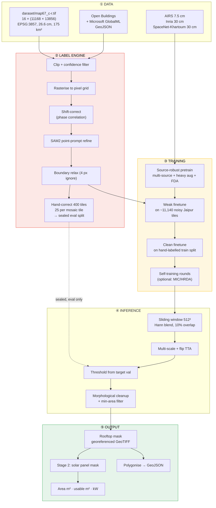
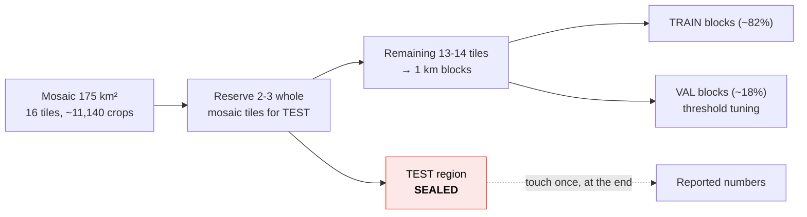
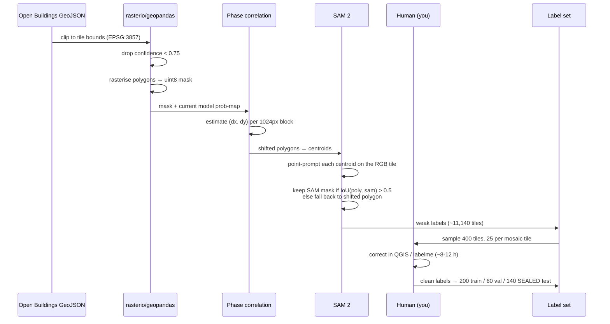
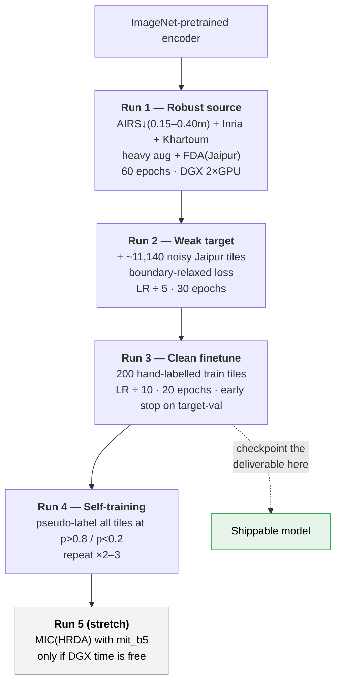
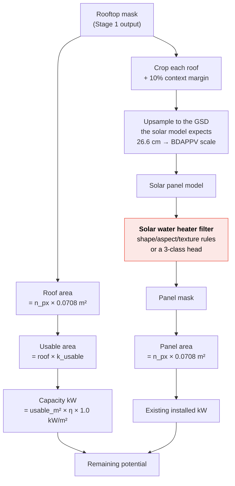

# 04 — The Full Pipeline

*End to end, from 16 GeoTIFFs on disk to a rooftop-solar capacity estimate for
Jaipur.*

---

## 1. System overview



---

## 2. Stage 0 — Tiling the Jaipur GeoTIFFs

Your existing `rooftop/tile_airs.py` tiles 10,000² AIRS images. Jaipur needs a
**georeferencing-aware** variant, because every tile must carry its affine
transform so predictions can be written back to map coordinates.

```
map67_<col>-<row>.tif   col,row ∈ 1..4     (16 files, ~8.2 GB)
each 11168 × 13856 px
        ↓  512 × 512, 10 % overlap (stride 461)
   24 cols × 29 rows = 696 tiles per file
        ────────────────────────────────
   696 × 16 ≈ 11,140 tiles   over ≈ 175 km²
```

Stage the source rasters on **G:** or the DGX — they do not fit on D:. See
[`01-situation-and-assets.md`](01-situation-and-assets.md) §7.1.

Per tile, persist a small sidecar JSON:

```json
{
  "tile_id": "map67_1-1_r012_c008",
  "src": "map67_1-1.tif",
  "row_off": 5532, "col_off": 3688,
  "width": 512, "height": 512,
  "transform": [0.2985821, 0.0, 8430350.4, 0.0, -0.2985821, 3116522.1],
  "crs": "EPSG:3857",
  "gsd_ground_m": 0.26613
}
```

**Quality filtering.** Reject tiles that are >30 % blank/black (mosaic edges) or
have near-zero variance (cloud, water, blur). Expect to lose 3–8 %.

**Split policy — read this twice.** Split tiles **spatially, by contiguous
block**, never randomly. Randomly-split overlapping tiles leak: two 10 %-
overlapping tiles from the same building put the same pixels in train and test,
and your reported IoU becomes fiction. Carve the mosaic into a checkerboard of
1 km blocks and assign whole blocks to train/val/test.

With 16 mosaic tiles you can do better than block splitting: **hold out 2–3
entire mosaic tiles** as the test region. Geographically disjoint beats
block-disjoint, and it is a materially stronger claim in the report.



Pick the test tiles to span fabric types — one dense walled-city tile, one
planned-colony tile, one peri-urban tile. A test set drawn only from the easy
outskirts would flatter the model.

---

## 3. Stage 1 — The label engine

This is the part that does not exist yet and is worth the most.



### Why each step is there

| Step | Removes which failure |
|------|----------------------|
| Confidence filter | Hallucinated detections in low-contrast areas |
| Shift correction | The 2–8 m georeferencing offset between the footprint source and Google's mosaic |
| SAM2 refine | The roof-vs-footprint semantic mismatch, and coarse polygon edges |
| IoU-0.5 fallback | Stops SAM from replacing a building with "the whole courtyard" when the prompt lands badly |
| Boundary relaxation | Residual sub-metre misalignment dominating the loss |
| Hand correction | Gives you *one* trustworthy set to report against |

### Hand-labelling budget

**400 tiles**, stratified at 25 per mosaic tile so all 16 areas and all urban
fabric types are represented. At 512² each takes ~2–4 minutes with a pre-filled
SAM2 mask to correct (vs 15+ minutes from blank). **Budget 13–17 hours of your
own time.** This is the single largest non-compute cost in the project and it
is unavoidable.
Do it early, in one or two sittings, before you are under deadline pressure.

Tools: QGIS with the raster + a GeoJSON edit layer is the most reliable. Label
Studio or `labelme` also work if you prefer per-tile PNGs.

---

## 4. Stage 2 — Training schedule



**Checkpoint the deliverable after Run 3.** Runs 4 and 5 are improvements; Run 3
is the point at which you have a working, defensible, reportable system. Never
be in a position where the deadline arrives mid-experiment with nothing saved.

### Loss

Keep `0.5 × BCE + 0.5 × Dice`, with two modifications for the target stage:

- `ignore_index` support so boundary-relaxed and pseudo-label `ignore` pixels
  contribute zero gradient.
- Optional per-sample weight: weak-label tiles at 0.5, clean tiles at 1.0, when
  training on a mixed batch.

### Metrics to log every epoch

Global IoU, F1, precision, recall (you already accumulate these correctly —
globally, not per-batch-averaged; keep that). **Add:**

- Boundary IoU (IoU restricted to a 5 px band around GT edges) — this is what
  catches the "merged blocks" failure that plain IoU hides in dense areas.
- Per-density-bin IoU: split the eval tiles into low / medium / high building
  cover and report all three. Your walled-city performance will be much worse
  than your outskirts performance, and averaging conceals it.

---

## 5. Stage 3 — Inference and geospatial output


Your `infer.py` already does the sliding window + Hann blending. What it needs
added: TTA, geotransform propagation, and the polygonisation tail.

---

## 6. Stage 4 — Solar and capacity estimation



### Constants — update these, the old ones are wrong for Jaipur

| Constant | AIRS value (current code) | **Jaipur value** |
|----------|---------------------------|------------------|
| GSD | 0.075 m/px | **0.26613 m/px** |
| Area per pixel | 56.25 cm² | **708.3 cm² = 0.07083 m²** |
| `k_usable` (fraction of roof usable after setbacks, tanks, stairwells, shading) | — | **0.55–0.70** for Indian flat roofs; use 0.60 and state it |
| Module efficiency η | — | 0.20 (modern mono-PERC) |
| Peak irradiance | — | 1.0 kW/m² STC |

So: `kW ≈ roof_pixels × 0.07083 × 0.60 × 0.20`.

**Make the GSD a parameter read from the GeoTIFF, never a hard-coded literal.**
Hard-coding it is exactly how the 10 cm assumption would have propagated a
2.8× error into every capacity number in your report.

### The solar water heater problem

Flat-plate and evacuated-tube solar water heaters are far more common on
Jaipur roofs than PV, and from directly overhead they present as dark
rectangular arrays — visually near-identical to a PV module to a model trained
only on French PV. Options, cheapest first:

1. **Report precision/recall separately** and characterise the confusion
   honestly. This is a legitimate finding, not a failure.
2. **Geometric rules** — evacuated-tube heaters show a strong periodic 1-D
   ripple and are usually accompanied by a cylindrical tank casting a round
   shadow. At 26.6 cm this is marginal but not hopeless.
3. **Add a third class** and hand-label ~200 water-heater instances from your
   Jaipur tiles. Best solution, ~4 hours of labelling, and it turns a weakness
   into a contribution.

---

## 7. Evaluation protocol (write this down and stick to it)

| Rule | Reason |
|------|--------|
| Spatial block splits, never random tile splits | Overlapping tiles leak |
| Threshold tuned on target **val**, reported on target **test** | Otherwise you tuned on your test set |
| Sealed test split touched once, at the end | Every peek is an implicit fit |
| Report AIRS in-domain IoU alongside Jaipur IoU | The gap *is* the result |
| Report per-density-bin and boundary IoU | Aggregate IoU hides dense-area failure |
| Report zero-shot baseline in every table | Without it, no one can see what adaptation bought |

The headline table in your report should look like:

| Model | AIRS test IoU | Jaipur test IoU | Δ |
|-------|---------------|-----------------|---|
| Current (AIRS-only, zero-shot) | 0.8664 | *(measure in Phase A)* | — |
| + Tier-1 alignment | 0.8664 | | |
| + robust multi-source | | | |
| + weak supervision | | | |
| + self-training | | | |
