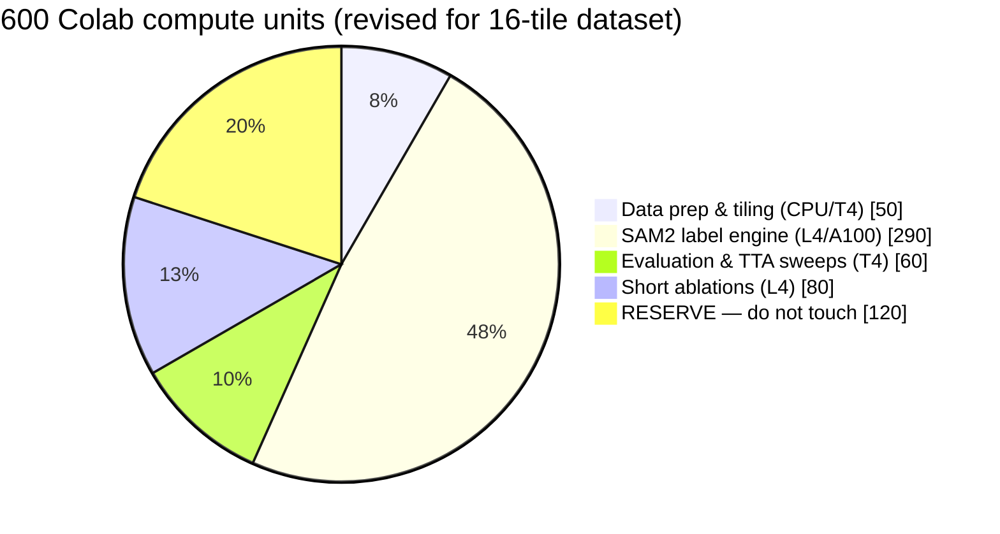
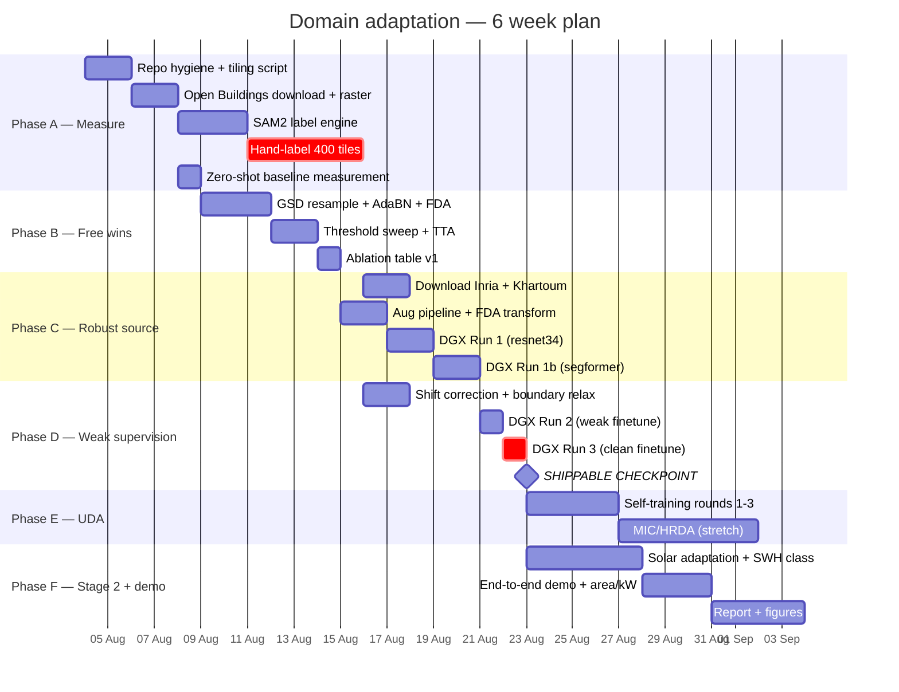

# 05 — Compute Budget and Schedule

*How to spend 600 Colab compute units and the DGX time, without running out
mid-experiment.*

---

## 1. Resources

| Resource | Capacity | Best used for | Constraint |
|----------|----------|---------------|------------|
| **Google Colab** | 600 compute units | Data prep, SAM2 labelling, evaluation, short ablations | Units are consumed *per wall-clock hour of an attached GPU runtime*, including idle time |
| **LNMIIT DGX** (`lnmdgx1`) | Returning imminently | All long training runs | Requires Docker (host glibc 2.17); `/scratch` is not persistent |
| **Local RTX 4050** | Always available | Code correctness, 10-sample smoke tests | 6 GB VRAM — batch size 2–4 at 512² |

---

## 2. Colab compute-unit burn rates

⚠️ **Published rates disagree and Google changes them.** Two sources found:

| GPU | Rate A (Aug 2026 source) | Rate B (2024 source) |
|-----|--------------------------|----------------------|
| T4 | ~1.19 CU/hr | ~1.76 CU/hr |
| L4 | not stated | ~4 CU/hr (est.) |
| A100 40 GB | ~5.40 CU/hr | ~15 CU/hr |
| A100 80 GB | ~7.52 CU/hr | — |

**Action:** before spending anything, open a Colab runtime, attach each GPU
type for 6 minutes, and read the actual drawdown from the "Compute units"
counter. Record the measured rates in this file. Budget against the
**pessimistic** column until you have measured.

### What 600 units buys, pessimistically (Rate B)

| GPU | Hours available if you spent it all here |
|-----|------------------------------------------|
| T4 | ~340 h |
| L4 | ~150 h |
| A100 40 GB | ~40 h |

The lesson is stark: **A100 hours on Colab are precious and T4 hours are
plentiful.** Since the DGX gives you free A100-class compute, Colab's job in
this project is *not* training.

---

## 3. Budget allocation



> ⚠️ **Revised 2026-08-04 for the full 16-tile dataset.** The allocation below
> was sized for ~1,180 tiles. The real dataset is **~11,140 tiles**, and
> SAM2-refining all of them would cost roughly **1,300 units — more than double
> the entire balance**. The fix is to refine only the tiles training actually
> consumes (400 clean + ~2,500 stratified weak ≈ 290 units) and leave the
> remaining ~8,200 on raw shift-corrected polygons. See
> [`01-situation-and-assets.md`](01-situation-and-assets.md) §7.2. If units get
> tight, drop the weak subset to 1,500 tiles before touching the reserve.

| Bucket | Units | Rationale |
|--------|-------|-----------|
| Data prep & tiling | 50 | Mostly CPU-bound (rasterio, geopandas). Use a **CPU-only** runtime where possible — it burns far fewer units. Tiling 16 GeoTIFFs is I/O-bound, not GPU work. |
| SAM2 label engine | 140 → **290** | SAM2-large over 2,900 selected tiles × ~40 prompts each is the one genuinely GPU-heavy Colab job. Needs L4 or A100. |
| Evaluation & TTA sweeps | 60 | 6× TTA over the ~1,700 val/test tiles, repeated per checkpoint. T4 is fine. **Do not TTA all 11,140 tiles per checkpoint** — evaluate on the splits, and run the city-wide pass once, at the end, on the DGX. |
| Short ablations | 80 | Threshold sweeps, AdaBN, FDA, histogram matching — all sub-hour experiments |
| **Reserve** | **120** | Non-negotiable. Thinner than the original 200 because SAM2 grew; guard it accordingly. |

**Moved to the DGX because of the size increase:** the final city-wide
inference pass (11,140 tiles × 6 TTA variants) and any pseudo-label generation
round. These are now hours of GPU time, not minutes, and Colab units should not
pay for them.

### Colab discipline (this is where units are actually lost)

1. **Never leave a GPU runtime idle.** Units burn on wall-clock, not on
   utilisation. Disconnect the moment a job ends.
2. **Use CPU runtimes for anything not doing matrix multiplication.** Tiling,
   rasterisation, GeoJSON clipping, and metric computation are all CPU work.
3. **Checkpoint to Drive every epoch.** A disconnected Colab runtime that loses
   4 hours of work has cost you real units for nothing.
4. **Do not train on Colab.** That is what the DGX is for.

---

## 4. DGX plan

| Run | Config | Wall clock (2 × V100/A100) |
|-----|--------|---------------------------|
| Run 1 — robust source | 3 datasets, heavy aug, 60 ep | 18–30 h |
| Run 1b — SegFormer variant | same data, `mit_b2` | 24–36 h |
| Run 2 — weak target finetune | +11,140 noisy tiles, 30 ep | 20–30 h |
| Run 3 — clean finetune | 200 tiles, 20 ep | < 1 h |
| Run 4 — self-training ×3 | pseudo-label + retrain | 12–18 h |
| Run 5 — MIC(HRDA) *(stretch)* | mmseg env, `mit_b5` | 40–60 h + setup |

**Total core (Runs 1–4): ~80–115 GPU-hours (Run 2 grew ~5x with the full dataset).** Comfortable if the DGX is
available; Run 5 alone nearly doubles it, which is why it is a stretch goal.

### DGX operating rules (from the existing README, still apply)

```bash
# 1. Verify CUDA before anything long
python -c "import torch; print(torch.cuda.is_available())"
# and confirm the first log line says  Device: cuda

# 2. screen on the HOST, not inside Docker
screen -S train

# 3. pick free GPUs
nvidia-smi
docker run --gpus '"device=0,1"' -it --rm --shm-size=16g \
    -v /scratch:/scratch -v $(pwd):/workspace -w /workspace btp_seg bash

# 4. copy data to local NVMe — /scratch NFS is ~4 s/it
cp -r /scratch/jaipur_crops /tmp/jaipur_crops
```

**`/scratch` is not persistent.** Every checkpoint must be rsync'd to Drive or
to your laptop the moment it is written. Losing Run 1 to a scratch wipe would
cost a week.

---

## 5. Schedule

Assumes DGX access from week 1. Slip the DGX-dependent phases if it is delayed;
Phases A and B are pure Colab and are never blocked.



### The two critical-path items

Marked `crit` above:

1. **Hand-labelling 400 tiles.** Nothing downstream can be *evaluated* without
   it. Start it in week 1. Do not let it slip to week 5.
2. **DGX Run 3 → shippable checkpoint.** The point where you have a defensible
   deliverable. Everything after it is upside.

---

## 6. Weekly checkpoint questions

Ask these every Friday. If the answer to any is "no", that is the week's
priority.

- [ ] Do I have a Jaipur number I could defend in a viva today?
- [ ] Is the sealed test split still sealed?
- [ ] Is every checkpoint mirrored off `/scratch`?
- [ ] How many compute units are left, and is the 200-unit reserve intact?
- [ ] Is the README and this plan folder updated with what actually happened?
