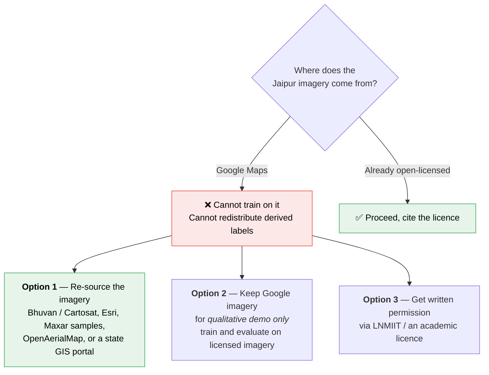

# 07 — Risks, Licensing, and Ethics

---

## 1. The licensing problem — read this before training anything

### What the terms say

Google Maps Platform's Service Specific Terms prohibit using Google Maps
content to **"train, test, validate or fine-tune"** machine-learning or AI
models. They separately prohibit creating derived content from Maps content,
with explicit examples including building 3D building models from imagery and
constructing indexes of features from Street View. Caching, storing, and
creating derivative map datasets are also restricted.

Your `daraset/*.tif` files are Web Mercator z19 mosaics with a Google-style
tiling geometry. If they were captured from Google Maps, then **using them as
training data is squarely inside what those terms prohibit** — and so is
publishing a derived building-footprint dataset for Jaipur.

### Why this is a real problem and not a formality

A BTP is submitted, archived, and potentially published. "It was only for a
student project" is not a licence term. And if you later want to write this up
for a workshop or journal, the first reviewer question about a novel dataset is
"where did the imagery come from and under what licence?"

### What to do about it — three viable options

### Properly-licensed Indian imagery to consider (verify each before relying on it)

| Source | Resolution | Notes |
|--------|-----------|-------|
| **ISRO Bhuvan** (bhuvan.nrsc.gov.in) | Cartosat-2/3, sub-metre to ~2.5 m in places | Indian government portal; check the specific product's terms and whether the resolution is sufficient |
| **OpenAerialMap** | Variable, often 5–30 cm | Community-contributed, openly licensed. Coverage of Jaipur is uncertain — check first. |
| **Esri World Imagery** | 30 cm–1 m | Terms vary by product and are more permissive for research than Google's in some cases — read them, do not assume |
| **Maxar Open Data** | 30–50 cm | Event-triggered releases (disasters). Jaipur unlikely to be covered. |
| **Sentinel-2** | 10 m | Free and unambiguous, but far too coarse for rooftops |
| **Local UAV capture** | 2–5 cm | If LNMIIT has a drone and airspace clearance, even 1 km² of self-captured imagery is a clean, citable, novel contribution |

**My recommendation:** Option 2 combined with a search for Option 1. Do the
methods development on the Google-sourced tiles *while you look for licensed
imagery*, but plan your report around whichever imagery you can legally
defend. The pipeline in [`04`](04-pipeline.md) is source-agnostic — it reads
the GSD from the GeoTIFF — so swapping the imagery late costs you a re-run,
not a redesign.

**Whatever you decide, write it down in the report.** A paragraph that says
"imagery provenance and licence: X, used under Y" is the difference between a
project that can be published and one that cannot.

### The label sources are fine

Microsoft GlobalMLBuildingFootprints (ODbL v1.0) and Google Open Buildings v3
(CC BY 4.0 **or** ODbL v1.0, your pick) are openly licensed and explicitly
intended for reuse. Note that ODbL is **share-alike**: if you publish a derived
database, it must also be ODbL. Choosing CC BY 4.0 for Open Buildings avoids
that obligation for that portion, but the Microsoft data is ODbL-only. Attribute
both.

---

## 2. Technical risk register

| # | Risk | Likelihood | Impact | Mitigation |
|---|------|:---:|:---:|---|
| R1 | **Hand-labelling slips to week 5** | High | Critical | It is on the critical path in [`05`](05-compute-and-schedule.md). Block two days in week 1. Label 100 tiles first so you always have *something*. |
| R2 | DGX access delayed beyond "imminent" | Medium | High | Phases A and B are pure Colab and unblocked. Reorder so all Colab work happens first. Keep a Colab-sized fallback config (`resnet18`, 256², 20 epochs). |
| R3 | Open Buildings coverage over Jaipur is sparse or badly offset | Medium | High | Check coverage *before* building the whole engine — Task 5 Step 1 should visualise 5 tiles' rasterised footprints over the imagery. If it looks wrong, fall back to more hand-labelling and a smaller study area. |
| R4 | SAM2 refinement makes labels *worse* | Medium | Medium | The IoU-0.5 gate in Task 6 is exactly this guard. Measure: compare hand-labelled tiles against raw-polygon and SAM-refined labels, and only adopt SAM if it wins. |
| R5 | Self-training collapses (confirmation bias) | Medium | Medium | Use `class_balanced_pseudo` rather than a global threshold; evaluate every round on hand labels; stop the moment val IoU drops. |
| R6 | Spatial leakage inflates the reported number | Medium | **Critical** | Block splits (Task 2). This is the failure that most often destroys a project's credibility in a viva. |
| R7 | Colab units exhausted in week 4 | Medium | Medium | The 200-unit reserve, and the discipline rules in [`05`](05-compute-and-schedule.md) §3. |
| R8 | `/scratch` wiped, losing Run 1 | Low | High | rsync every checkpoint off `/scratch` immediately. |
| R9 | Mosaic seams / multi-date tiles confuse the model | High | Low | Photometric augmentation covers it. Flag the affected tiles in the eval set and report their IoU separately if it is notably worse. |
| R10 | Solar water heaters flood Stage 2 with false positives | High | Medium | Report precision/recall separately; consider a third class ([`04`](04-pipeline.md) §6). Treat it as a finding, not a bug. |
| R11 | Dense blocks merge into single blobs | High | Medium | Boundary IoU catches it; frame-field / boundary-loss is the fix if per-instance output is required. |
| R12 | Reported Jaipur IoU is much lower than the AIRS 0.90 and reads as failure | High | Low | Frame it correctly: the AIRS→Jaipur gap *is* the contribution. Publish the gap, the ablation, and the failure analysis. A well-characterised 0.80 is worth more than an unexplained 0.90. |

---

## 3. Scientific-integrity checklist

Tick each of these before the number goes in the report.

- [ ] Test split is spatially disjoint from train and val, by contiguous block.
- [ ] Test split was read exactly once, after all training was finished.
- [ ] The decision threshold was chosen on val, not test.
- [ ] The zero-shot baseline appears in every comparison table.
- [ ] The AIRS in-domain number is reported alongside the Jaipur number.
- [ ] Ablations are cumulative and each row states what changed.
- [ ] Negative results (things that did not help) are reported.
- [ ] Every constant used in the capacity estimate (`k_usable`, η, GSD) is
      stated in the text, not buried in code.
- [ ] The label noise in the weak-supervision set is characterised, not glossed
      over — report the IoU between raw Open Buildings labels and your hand
      labels, so a reader knows how noisy the supervision was.
- [ ] Imagery provenance and licence are stated.

---

## 4. Ethical considerations

Worth two paragraphs in the report; they are also genuinely true.

**Surveillance and privacy.** A rooftop-level building database of a city is
dual-use. At 26.6 cm you cannot identify people, but you *can* produce a
per-household map of who has a solar installation, and by extension a proxy for
household wealth. Publish aggregate statistics and models; think carefully
before publishing per-building attribute data for a real neighbourhood.

**Informal settlements.** Building-footprint models systematically underperform
on dense informal settlements — the exact areas where mapping would be most
socially valuable and where errors do the most harm (e.g. if the output fed
into service planning or, worse, demolition decisions). Report your
per-density-bin IoU precisely so this limitation is visible rather than
averaged away.

**Capacity claims.** A kW figure derived from a segmentation mask times three
assumed constants is an *order-of-magnitude estimate*, not an engineering
assessment. Label it as such everywhere it appears. Roof structural capacity,
shading from adjacent buildings, grid connectivity, and tenure are all outside
what this model can see.
