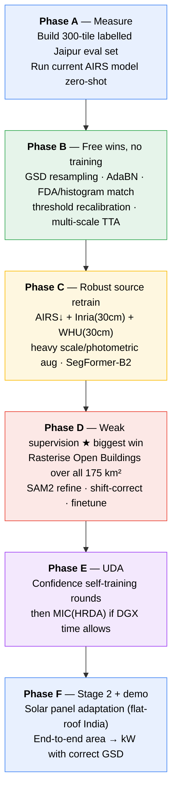

# Domain Adaptation Plan — Christchurch (AIRS) → Jaipur

**Status:** Planning · **Created:** 2026-08-04 · **Owner:** Sirjan Singh (23ucs715, LNMIIT)

This folder is the complete plan for taking the existing rooftop + solar-panel
segmentation models — which were trained on **New Zealand (AIRS)** and **French
(BDAPPV)** imagery — and making them work on **Jaipur, India** imagery.

---

## Read in this order

| # | Document | What it answers |
|---|----------|-----------------|
| 0 | **README.md** (this file) | TL;DR, the one-page answer |
| 1 | [`01-situation-and-assets.md`](01-situation-and-assets.md) | What do we actually have, right now, measured? |
| 2 | [`02-domain-gap-analysis.md`](02-domain-gap-analysis.md) | *Why* the model will fail on Jaipur — the six gaps, quantified |
| 3 | [`03-methods-and-literature.md`](03-methods-and-literature.md) | What the field does about it, with sources and a ranked shortlist |
| 4 | [`04-pipeline.md`](04-pipeline.md) | The full end-to-end pipeline, with diagrams |
| 5 | [`05-compute-and-schedule.md`](05-compute-and-schedule.md) | How to spend 600 Colab compute units + DGX time |
| 6 | [`06-implementation-plan.md`](06-implementation-plan.md) | Task-by-task, executable, with code |
| 7 | [`07-risks-licensing-ethics.md`](07-risks-licensing-ethics.md) | What can go wrong, and the imagery-licensing problem |
| 8 | [`08-sources.md`](08-sources.md) | Every source cited, with links |

---

## TL;DR

### Four things you need to know before anything else

**0. The dataset is 16 tiles / ~175 km² / 8.2 GB — and it will not fit on this laptop.**

The [Drive folder](https://drive.google.com/drive/folders/1CruuRQUNddyQYGrTWfZw3rsxl4iz3hVF)
holds `map67_<col>-<row>.tif` for a 4 × 4 grid; only 2 are downloaded locally.
The full mosaic is 44,672 × 55,424 px covering essentially all of Jaipur —
**≈ 11,140** training tiles and an estimated **300k–500k** free building
footprints. Excellent news for the method, but C: has 1.6 GB free and D: has
7.8 GB, against an 18–27 GB end-to-end footprint. Stage it on **G:** or pull it
straight to the **DGX**, never to D:. Details and a subset fallback in
[`01`](01-situation-and-assets.md) §7.

**1. Your Jaipur imagery is 26.6 cm/pixel, not 10 cm/pixel.**

Measured directly from the GeoTIFF headers of `daraset/map67_1-1.tif` and
`map67_1-2.tif` (see [`01`](01-situation-and-assets.md) for the arithmetic).
They are Web Mercator (EPSG:3857) zoom-level-19 mosaics. The `ModelPixelScale`
tag says 0.2986 m/px, but that is *Mercator* metres, which are stretched by
`1/cos(latitude)`. At Jaipur's latitude (26.96° N) the true ground sample
distance is:

```
0.2986 × cos(26.96°) = 0.2661 m/px  ≈ 26.6 cm/px
```

This matters enormously. AIRS is **7.5 cm/px**. That is a **3.55× resolution
gap**, not the 1.3× gap you would have if the imagery really were 10 cm. The
resolution gap is the single largest source of domain shift in this project,
and it changes every downstream number — including the m²-per-pixel constant in
your area/capacity estimate (56.25 cm²/px for AIRS vs **708 cm²/px** for Jaipur,
a 12.6× difference).

**2. You have no Jaipur labels, and that is the actual bottleneck.**

You cannot do domain adaptation, or even *report* domain adaptation, without a
labelled target-domain test set. Everything else in this plan is blocked on
building one. The good news: you do not have to draw it by hand from scratch —
Microsoft and Google both publish free, openly-licensed building footprints
covering Jaipur, and SAM2 can snap them to the actual roof edges. See
[`04-pipeline.md`](04-pipeline.md) §3.

**3. Google Maps imagery cannot legally be used to train models.**

The Google Maps Platform terms explicitly prohibit using Maps content to
"train, test, validate or fine-tune" machine-learning models. This is a real
problem for a submittable BTP. It is solvable — there are properly-licensed
Indian imagery sources — but you need to decide *now*, not after training.
Read [`07-risks-licensing-ethics.md`](07-risks-licensing-ethics.md) first if
you plan to publish or submit this work.

---

### The recommended path, in one diagram



### Expected outcome

These are *planning targets*, not promises. IoU is on the Jaipur eval set,
building class, 512×512 tiles at native 26.6 cm.

| Phase | What it adds | Expected Jaipur IoU |
|-------|--------------|---------------------|
| A — zero-shot baseline | nothing; this is the measurement | **0.35 – 0.55** (expect ugly) |
| B — input-space alignment | GSD match + colour + threshold | 0.50 – 0.65 |
| C — robust multi-source source model | scale aug + 30 cm sources | 0.62 – 0.72 |
| D — weak supervision from Open Buildings | ~40k free noisy Jaipur labels | **0.74 – 0.82** |
| E — self-training / MIC | target-domain consistency | 0.78 – 0.85 |

For reference, your AIRS in-domain IoU is 0.9016. **Do not expect to reach that
on Jaipur.** Dense Indian urban fabric at 26.6 cm is a genuinely harder problem
than suburban Christchurch at 7.5 cm, and published cross-domain building
segmentation results in dense Indian cities land in the 0.70–0.85 band.
Landing at 0.80 with a documented, honest gap analysis is a strong BTP result.
Claiming 0.90 would mean you leaked labels somewhere.

---

## Compute at a glance

| Resource | Amount | Use it for |
|----------|--------|------------|
| Google Colab | 600 compute units | Data prep, SAM2 labelling, evaluation, short ablations |
| LNMIIT DGX (`lnmdgx1`) | returning imminently | All long training runs (Phases C, D, E) |
| Local RTX 4050 | always | Code correctness, 10-sample smoke tests |

Full budget breakdown, with per-GPU burn rates and a reserve policy, is in
[`05-compute-and-schedule.md`](05-compute-and-schedule.md).

---

## Files this plan will add to the repo

Nothing in this folder is code yet. [`06-implementation-plan.md`](06-implementation-plan.md)
specifies exactly which files to create, in which order, with tests.
